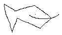

# fisk

A simple concatenative language inspired by FORTH and Lisp.
All primitives are defined using C-functions and the language itself does not use the standard library.

## Roadmap / TODO list
- [ ] "Finish" the language / Add storing and executing symbols.
- [ ] Clean up code.
- [ ] Improve primitive creation API.
- [ ] Make processes configurable without macros.
- [ ] Create standard libraries:
    - [ ] Core (+, -, dup, print, etc...)
    - [ ] String (concat, len)
    - [ ] HTTP (idk, man i'm just writing stuff at this point)

## Extra features (if I want to)
- [ ] External struct support.
- [ ] Optimize, optimize, optimize.

